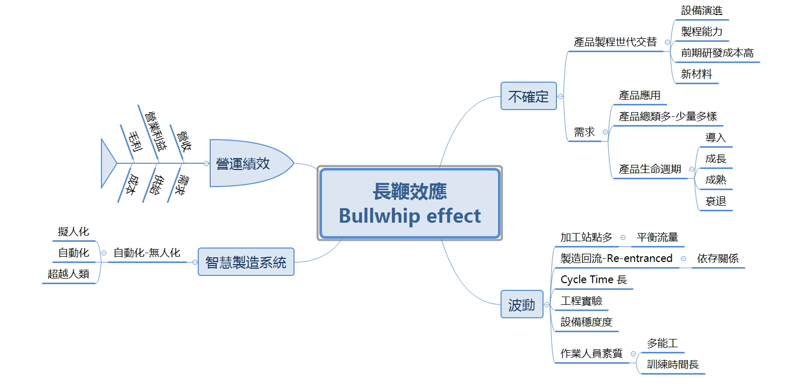

垂直整合型企業內部供應鏈流程改善 - 以資訊部門的觀點

***

#### 企業內部供應鏈

供應鏈指的是原料從取得傳送，配合倉儲運輸，生產規劃，存貨以及配銷等所有物流直到終端消費產品等過程。(Ellram 1989)。而企業內部供應鏈主要因為製造的特性不同，為管理方便以功能別為條件，設立不同功能別的製造廠形成類似供應商與製造商的上下游關係。垂直整合性企業因整合產業內上下游，所以公司內部的生產排程就類似於整個供應鏈的串聯，必須取得上游原料轉換為半成品，等待下游拉貨製造轉換下階半成品，甚至委外加工直到最終成品配送到配銷與零售商為止。所以在供應鏈中分別存在著物流與資訊流兩部分。整以來說除了前述的物流與 資料流外尚包含了供應商，採購與物料管理及產能規劃與生產配送等。

本研究機業內部供應鏈定義為：整合企業內部與外部產銷流程，管理供應商以及所有參與成員，希望創造利潤最大化與降低庫存

#### 長鞭效應(Bullwhip)

1961年由 [J Forrester](https://zh.wikipedia.org/w/index.php?title=J_Forrester&action=edit&redlink=1) 所提出。在商業活動中，企業根據過往的**統計資料**或者是**對景氣與未來的判斷**來建置產能與供應計畫。在缺乏正確資訊的判斷下，為避免損失市占率與掉單，通常會保留一部分庫存作為安全庫存。在供應鏈中，由終端客戶到原物料供應商中，每一段供應者都會建立庫存。所以當需求增加時，下游企業預期會需要增加供給，所以建立更多安全庫存。當需求降低時，下游的廠商將會踩剎車減少或者停止訂貨。這種因為需求變動導致數量隨著供應鏈一層層往上回朔而被放大或縮小的狀態稱為長鞭效應。這種現象就像抖動一根鞭子一樣，末端輕微的變化將使得末梢出現很大的波動。 

長鞭效應可能使得企業，可能堆積過多的庫存，或缺料導致無法準時交貨，甚至接單使得客戶服務差，損失收入。另外也可能因此建立錯誤的產能建置計畫積壓資金，或者產生不經濟的運送計畫(海運改空運)。

##### 長鞭效應形成的原因

1. 需求修正 
2. 批次訂購  
3. 價格波動 
4. 定量配額   

##### 如何解決長鞭效應

1. 資訊共享資訊共享可分為三個層級，供應鏈資訊分享會與信任度與交會資訊的組織層級，商業機密與資訊系統的整合，所以資訊分享的成本與效益也是必須要考慮的。
   1. 作業資訊
   2. 管理資訊
   3. 策略資訊
2. channel alignment
3. operaton 

##### 參考資料

[維基百科 長鞭效應](https://zh.wikipedia.org/wiki/%E9%95%BF%E9%9E%AD%E6%95%88%E5%BA%94) [Lee, H. L., V. Padmanabhan, and S. Whang. 1997. The bullwhip effect in supply chains. MIT Sloan Management Review 38 (3):93.](C:/Data/Thu_Mast_ACC/論文/論文閱讀/The_Bullwhip_Effect_in_Supply_Chains.pdf) 

