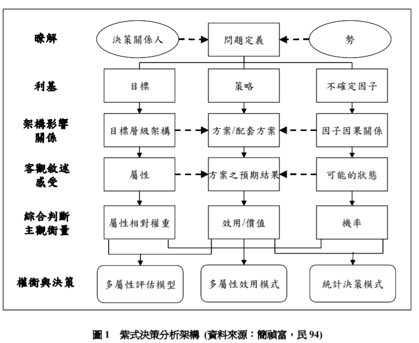

紫式決策分析 

***

1978 年諾貝爾經濟學獎得主司馬賀教授（Herbert  Simon）則認為決策是結合事實性（factual）與價值性（valuational）兩種判斷的邏輯推理過程之結果（Simon, 1947, 1997）。 

決策是一種過程在這個過程中，人會藉由自己的認知，在需多選擇中依據所收集到的各種訊息，加以分析推理出可能的變化藉以擬定方案與行動。決策的過程之中將面臨決定後依據行動所導致的不同結果。所以在決策前需要評估各種風險與利弊得失，決策往往是在資訊不完整的狀況下做判斷，所以會面臨有許多的不確定性。

簡禎富 (民 94) 發展「紫式決策分析架構 」 (UNISON Decision Analysis Framework) 作為一般化的思維架構，包含六大階段：瞭解問題 (Understand)、界定利基 (Niche) 、架構影響關係 (Structure Influence Relationship) 、客觀敘述 感受 (Sense and Describe the Results) 、綜合判斷與主觀衡量 (Overall Judgment and Measurement) 以及最後的權衡與決策 (Tradeoff and Decision) 

垂直整合型企業購併後資訊流程的改善-以存貨管理為例 

本研究主要內容分成生產排程規劃決策研究與建立評估管理機制與指標兩大部分： 

存貨管理策略與指標

存貨管理策略可產繩的效益與影響

+ 降低成本
+ 提高存貨週轉率
+ 降低存貨跌價損失
+ 改善工作流程及方法，提高工作效率

常見方法

+ 運用系統整合整體供應鏈、
+ 管理能力思維和視野不斷創新等。 

存貨的定義與功能

+ 存貨成本
+ 存貨管理策略

生產排程規劃決策

紫式決策分析架構

+ 定義問題

  垂直整合型企業購併後資訊流程的改善

+ 利基

+ 架構

+ 客觀敘述

+ 主觀衡量

+ 權衡與決策

  

#### 參考資料

[決策定義](https://zh.wikipedia.org/wiki/%E5%86%B3%E7%AD%96) [半導體購併風潮，掀起水平、垂直整合討論](http://finance.technews.tw/2015/09/17/semiconductor-mergers-and-acquisitions/) 